# Obsictionary

Turn plain Obsidian notes into spaced-repetition **dictionaries**

A dictionary is just a markdown note: free-form theory on top, a `## Words` table below. Dictionaries open in an **interactive view** (Excalidraw-style) with an auto stats panel; the `srs`/`due` bookkeeping columns stay hidden and "Open as markdown" shows the source. They also render as a styled dictionary in normal reading mode

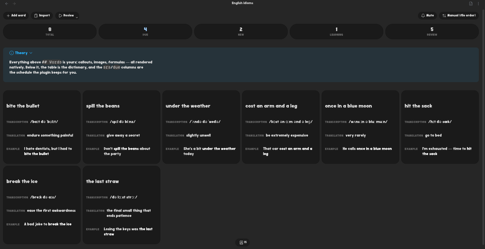

In the view you can:

- add words, or bulk-import many at once (one per line, `|` or `;` columns; blank fields are auto-filled with their column name)
- edit any field inline — paste an attachment to embed it, or type `[[` for wiki-link autocomplete across every vault file
- drag the handle on a card to reorder (a line shows the insert position)
- sort the list by word, by due date or at random — the toolbar's sort menu, with the starting order in the settings. Picking **Random** again reshuffles
- delete a word (with confirmation)
- edit the theory block live (written back above `## Words`)
- review words as flashcards (scheduled with [FSRS](https://github.com/open-spaced-repetition/ts-fsrs)) — see [Reviewing](#reviewing)
- mute a dictionary so it stops counting toward reminders

Custom fields are just extra columns. Frontmatter keys (graph links like `up`/`source`, `related`, or your own) render in the header as one inline row of properties — wikilink/URL values become clickable links; pick which keys and their order in the plugin settings. Audio/image attachments referenced with `![[name]]` are resolved vault-wide

## Contents

- [A dictionary note](#a-dictionary-note)
- [Not only words](#not-only-words)
- [Reviewing](#reviewing)
- [Stats](#stats)
- [Dashboard and shelf](#dashboard-and-shelf)
- [Reminders](#reminders)
- [Creating dictionaries](#creating-dictionaries)
- [Development](#development)
- [Roadmap](#roadmap)
- [License](#license)

## A dictionary note

```markdown
---
obsictionary: {}
level: B2
---

> [!info]+ Theory
> Any markdown here — callouts, images, formulas — is rendered as-is.

## Words

| word       | transcription  | translation | due        | srs |
| ---------- | -------------- | ----------- | ---------- | --- |
| ubiquitous | /juːˈbɪkwɪtəs/ | widespread  | 2026-07-10 |     |
```

- A note is a dictionary because it carries the `obsictionary` property. The property is where presets and mute live; on a fresh dictionary it is simply empty. Notes marked the old way — with the `#obsictionary` tag — are found on start-up, and **Convert tagged notes into dictionaries** adds the property to them
- Everything **before** `## Words` is theory and rendered natively
- Columns are whatever the table defines. By default the **first** content column is the card front (the question) and the rest are the answer; a [review preset](#reviewing) can split them any other way. New dictionaries start from the columns set in **New dictionary columns** in the plugin settings
- Add/import warn about missing fields; rows added by hand in the source are cleaned up when the dictionary opens: gaps filled with the column name, empty rows dropped, and a column with neither a name nor any content removed. An `srs` cell the plugin cannot read is **not** touched — that cell is the only copy of a word's history, so the word is reviewed as new (the next grade overwrites it) and the view says which words are affected. The usual cause is an unescaped `|` further along the row, which shifts every cell after it
- `srs` is a managed column (compact FSRS state); `due` is a readable copy
- Attachments are resolved vault-wide by basename via the Obsidian API — put them anywhere

## Not only words

A column holds whatever markdown you put in it, and the first column is the question — so a card can ask with a picture, a sound or a clip just as easily as with a word

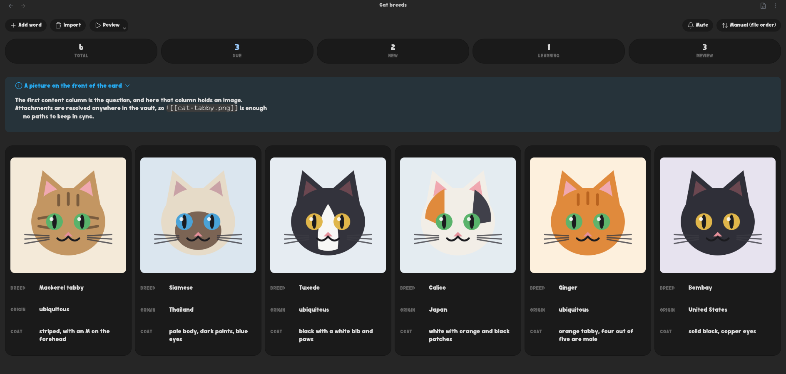

Video embeds play in the card and in the word list, which is enough for a gesture, a sign or a stroke order

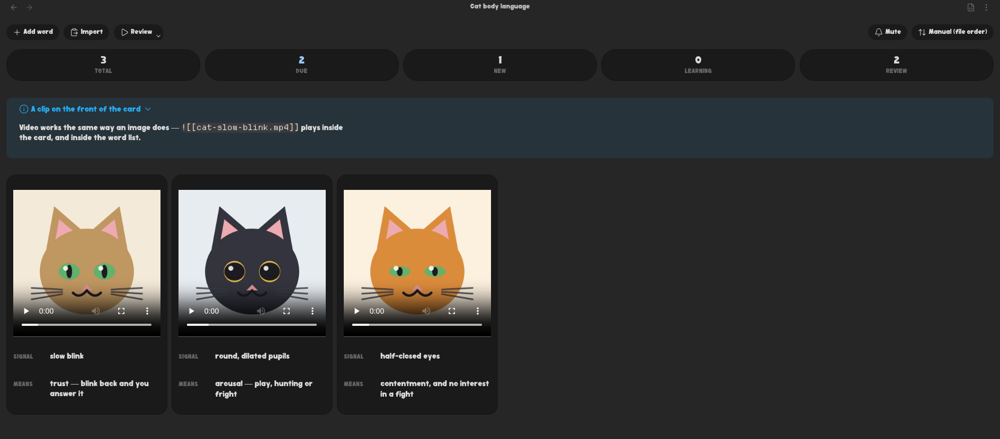

Audio works the same way — ear training, birdsong, a pronunciation clip recorded next to the word

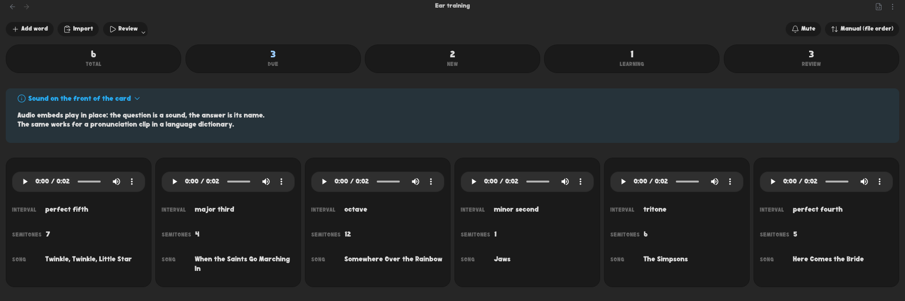

And nothing says the answer has to be a translation: swatches with their hex, or any pair of fields you like

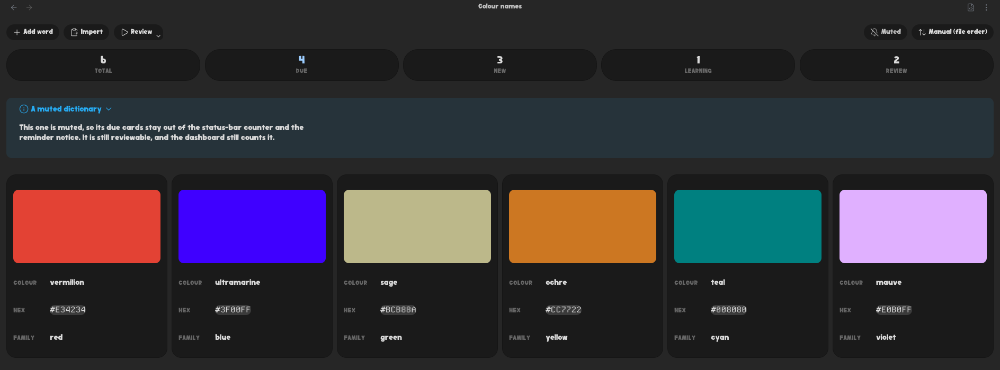

## Reviewing

The **Review** button is split. Clicking it starts straight away; the caret in its corner opens a dialog where you choose:

- **Question / Answer** — which columns go on each side of the card. A column can only be on one side, and a front that covers every column simply has no reveal step
- **Cards** — only what is scheduled (`Due only`), or every word in the dictionary (`All cards`)
- **Order** — shuffled (the default) or dictionary order. Only a preset that says `order: file` reviews in file order; a preset that says nothing shuffles like everything else. A vault-wide session shuffles the dictionaries _together_, not each one in place
- **Record progress** — off means grading changes nothing on disk. Picking `All cards` turns it off by default: that is the "just go through the words" mode

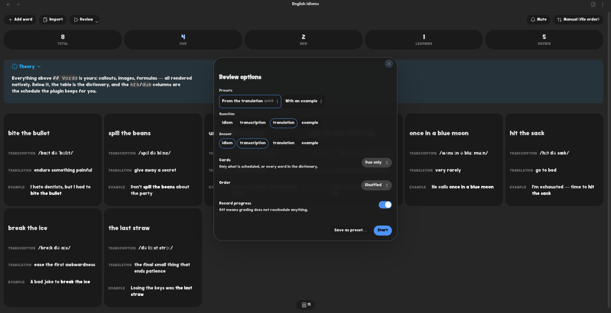

By default the answer joins the question on screen rather than replacing it, so the whole entry ends up on one side of the card; **Keep the question when revealing** turns the card back over

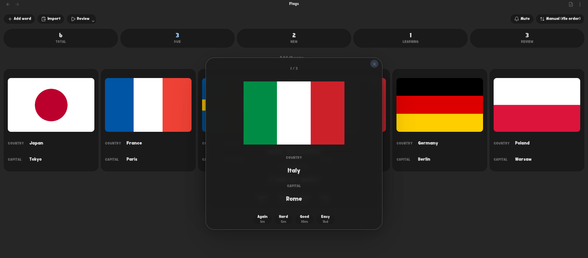

Save a choice as a named **preset** and it lands in the note's frontmatter under the `obsictionary` key. The first preset is what the plain click runs — the `quick` one; any preset's menu can make it first. Nothing else in that key is touched, so anything you hand-write there survives

```yaml
---
obsictionary:
  mute: false
  presets:
    - name: Reverse
      front: [translation]
      back: [word, transcription]
      pool: all # due | all
      order: file # shuffled (default) | file
      record: false
---
```

Presets are reconciled against the real table every time: a preset naming a column the table no longer has still reviews, without it, and says so

Review scope (the active note or the whole vault) is a plugin setting; in vault scope each dictionary keeps its own columns and only the session-wide choices are applied on top

**Target retention** decides how long an interval FSRS is willing to give, and it is applied when a card is graded — so changing it leaves every date already on disk where it was. **Recompute schedule for current retention** brings them into line in one pass: it recomputes each interval from the stability already stored, moves only cards in the review state, and never touches what the plugin knows about your memory. It asks first, and says how much it moved

## Stats

The interactive view shows a stats panel (Total / Due / New / Learning / Review) automatically. Every tile starts the session it counts: `Due` reviews what is scheduled, `Total` is practice over every word without touching the schedule, and `New`/`Learning`/`Review` draw from all cards in that FSRS state. To embed stats in **another** note, use a code block:

````markdown
```obsictionary-stats
vault
```
````

- empty body — stats for the current note (when it is a dictionary)
- `vault` (or `all`) — an aggregate across every dictionary in the vault
- a dictionary name, path or `[[wiki-link]]` — stats for that specific dictionary

One scope per line, so a block can cover any set of dictionaries — and a `+muted` / `-muted` written after a scope belongs to that line, while one on a line of its own sets the block's default:

````markdown
```obsictionary-stats
[[Cat breeds]]
[[Flags]]
[[Ear training]]
```
````

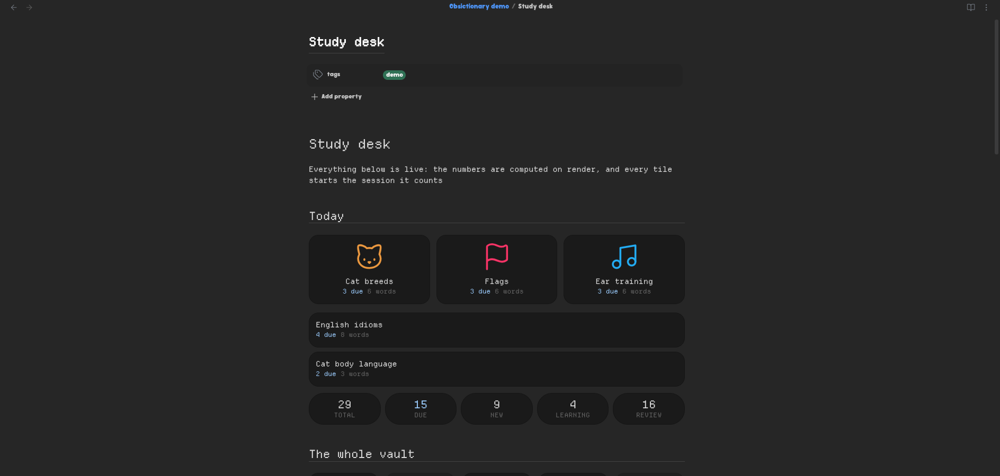

Muted dictionaries stay out of the `vault` aggregate; **Count muted dictionaries** in the settings changes that globally, and `+muted` / `-muted` overrides it for one block — on its own line or after the scope (`vault -muted`). A block naming one dictionary always shows it, muted or not

Above the numbers, every dictionary the block covers gets a tile of its own — its name, what is due in it, and a way in. With the Iconic integration on, a dictionary you gave an icon gets a picture tile like the ones on the shelf; the rest are a single-column list. A scope that matches nothing says so instead of quietly under-counting

Embedding a dictionary with `![[Some dictionary]]` shows the same card, rather than transcluding every word in it. `![[Some dictionary#Theory]]` still embeds that section as usual — asking for one part of a note is a different question

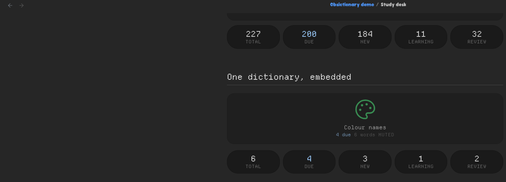

Values are computed live on render, so nothing is written to frontmatter (it would go stale)

## Dashboard and shelf

The dashboard ribbon icon (or the **Open dictionary dashboard** command) opens a vault-wide overview: totals across every dictionary, then a row per dictionary with its numbers, a way in, a review button and a mute toggle

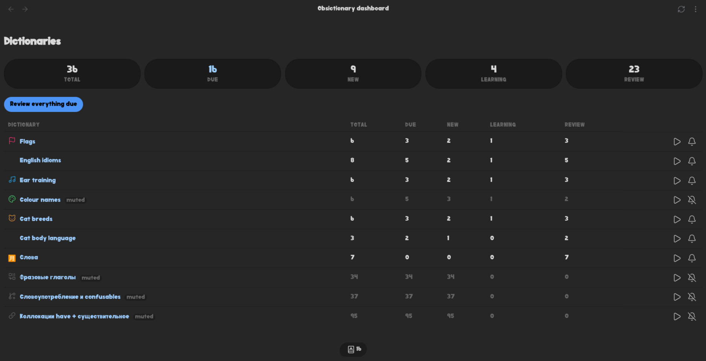

**Open dictionary tiles** shows the dictionaries and nothing else. Each tile shows what is due and opens the dictionary on click; hover or tab to it for a review button in its corner

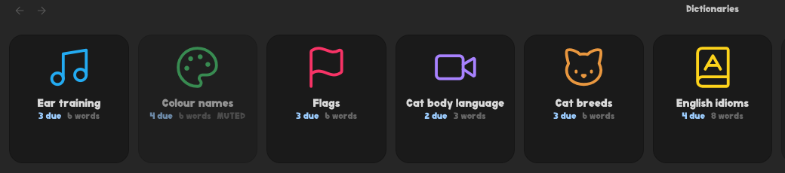

The **Integrations** section of the settings has **Icons from Iconic**, off until you turn it on. Enabled, a dictionary you gave an icon to in [Iconic](https://github.com/gfxholo/iconic) gets a picture tile at the top and the rest fall into a single-column list of text tiles below, so the shelf follows a choice you already made instead of asking for it again; disabled, it is simply that list. The dashboard shows the same icons beside the names in its table, so the two views agree on what a dictionary looks like. Without Iconic installed the switch is shown but greyed out — there would be no icons to read. Iconic keeps them in `.obsidian`, which is inside the vault but raises no vault events, so both views have a **Reload icons** action in their header for after you set one

## Reminders

With cards waiting, the plugin shows a notice on start-up and keeps a counter in the status bar; clicking either reviews exactly the cards it counted. Settings:

- **Remind me about due cards** — the master switch; off means no notice and no counter, and the plugin stops tracking due cards at all
- **On start-up** — the notice when Obsidian opens
- **Repeat every** — minutes between reminders while Obsidian stays open; empty or zero means start-up only
- **Status bar counter** — the number, hidden when nothing is due

A single dictionary can be **muted** — from its toolbar, its file menu or the dashboard — and then it stops contributing to the counter and the notices. It is still reviewable, and still counted on the dashboard (its row is marked)

## Creating dictionaries

**New dictionary note** creates one in the default location for new notes. Right-clicking a folder offers **New dictionary here** instead

## Development

Requires Node 22+

```bash
npm install
cp .env.example .env      # set OBSIDIAN_PLUGIN_DIR to your vault plugin folder
npm run dev               # watch build, copies artifacts into the vault
npm run check             # typecheck + lint + tests
npm run build             # production build
```

The build copies `main.js`, `manifest.json` and `styles.css` into the folder named by `OBSIDIAN_PLUGIN_DIR`

## Roadmap

- [x] Notify-reminders
- [ ] Inline hints in other files
- [ ] Translate the plugin to multiple languages

## License

MIT
